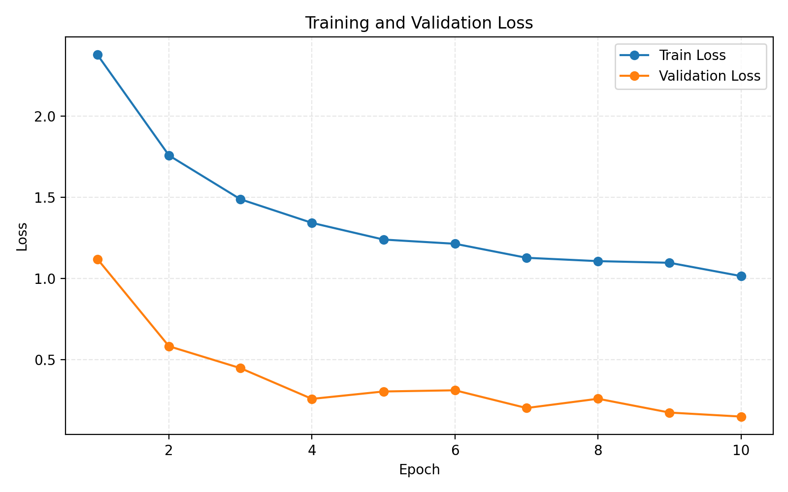
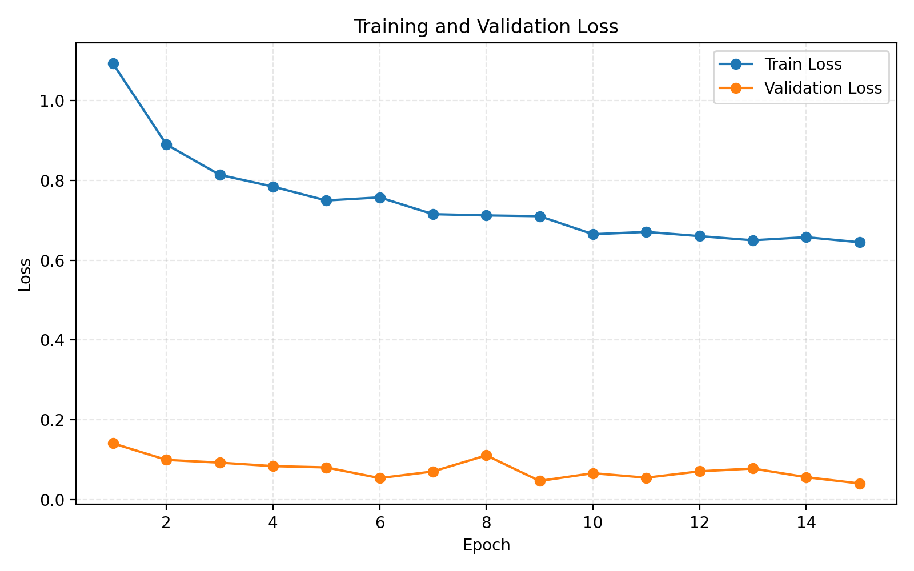
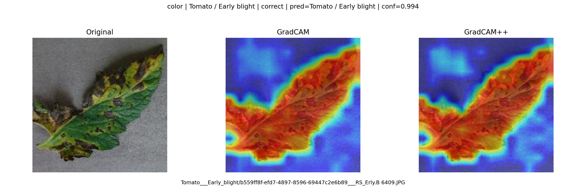
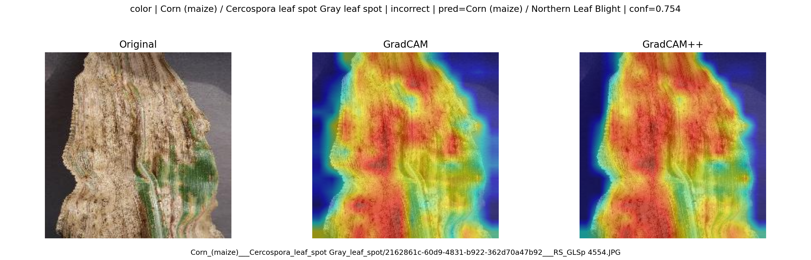

# Plant Disease Recognition via Transfer Learning and GradCAM Explainability on PlantVillage

**COMP6341 Project Report**

---

## Abstract

Accurate automated detection of plant diseases is critical for precision agriculture. We present a systematic study on the PlantVillage dataset (54,305 images, 38 classes across 14 plant species) comparing training strategies, model architectures, and input modalities for multi-class leaf disease classification. Starting from a ResNet-18 baseline (97.53% accuracy), we show that full fine-tuning of pretrained Vision Transformers (ViT-Small) achieves **99.34% Top-1 accuracy and 99.09% Macro F1** on color images. Ablation experiments over three dataset versions (color, grayscale, background-segmented) reveal that color is an essential diagnostic feature, while background content has negligible influence on classification. GradCAM and GradCAM++ visualizations confirm that the model focuses on semantically meaningful lesion regions, with identified failure modes concentrated in visually similar disease pairs.

---

## 1. Introduction

Plant pathogens annually destroy an estimated 20–40% of global crop yields, making early and accurate disease diagnosis a pressing challenge. While human experts can identify diseases from leaf imagery, scaling such inspection is infeasible. Convolutional and transformer-based neural networks trained on curated datasets offer a path to scalable, automated diagnosis.

The PlantVillage dataset [Hughes & Salathé, 2015] provides a controlled benchmark with standardized leaf photographs covering healthy and diseased conditions across 14 crop species. Despite high inter-class variety, many disease categories share subtle visual cues (e.g., *Tomato Early Blight* vs. *Tomato Bacterial Spot*), making high-confidence multi-class classification non-trivial.

This work addresses three research questions: (1) How does training strategy (from-scratch vs. linear probing vs. full fine-tuning) affect performance? (2) Does removing background information via segmentation improve accuracy? (3) Which image regions drive model decisions, and where do failures occur?

---

## 2. Dataset and Preprocessing

**PlantVillage** contains 54,305 images organized into 38 disease/health classes. Three input modalities are provided: *color* (RGB), *grayscale*, and *background-segmented* (green background removed). All images are resized to 224×224. The dataset is split deterministically with a fixed seed (80% train / 10% val / 10% test), yielding 43,444 / 5,430 / 5,431 samples respectively. The same split manifest is reused across all experiments for fair comparison.

**Data augmentation** (training only): `RandomHorizontalFlip`, `RandomVerticalFlip`, `RandomResizedCrop(224)`, `ColorJitter(brightness=0.2, contrast=0.2, saturation=0.2, hue=0.1)`, and MixUp (α = 0.4).

---

## 3. Methodology

### 3.1 Models and Training Strategies

We evaluate four model–strategy combinations:

| Model | Strategy | Pretrained | Notes |
|---|---|---|---|
| ResNet-50 | From Scratch | No | Baseline, no transfer |
| EfficientNet-B3 | Linear Probing | Yes (ImageNet) | Frozen backbone, only head trained |
| EfficientNet-B3 | Full Fine-tune | Yes (ImageNet) | All layers updated |
| ViT-Small | Full Fine-tune | Yes (ImageNet) | Patch size 16, full unfreeze |

All models use **AdamW** (lr = 1×10⁻³, weight decay = 1×10⁻⁴), cross-entropy loss, and cosine learning rate scheduling. Checkpoints are saved at minimum validation loss; the best checkpoint is used for test evaluation.

### 3.2 GradCAM Explainability

For Part 3, the ViT-Small full fine-tuning model is selected as the analysis target. **GradCAM** [Selvaraju et al., 2017] and **GradCAM++** [Chattopadhay et al., 2018] are applied to the final attention block. For each of the 38 classes, one representative *correct* and one *incorrect* prediction are identified from the test set. The three dataset versions (color, grayscale, background-segmented) are aligned to the same color test split for a fair cross-modality comparison.

---

## 4. Experiments

### 4.1 Part 1: ResNet-18 Baseline

A standard ResNet-18 pretrained on ImageNet is fully fine-tuned for 10 epochs (batch size 32) as the project baseline.

*Figure 1: Training and validation loss for the ResNet-18 baseline (10 epochs). Validation loss converges to ~0.22, consistent with the 97.53% test accuracy.*

**Result:** Test Accuracy = **97.53%**, Test Macro F1 = **96.34%**. The baseline establishes a strong starting point but leaves room for improvement on hard classes.

### 4.2 Part 2: Model Comparison

Table 1 reports validation metrics for all four color-dataset experiments. Full fine-tuning of pretrained models substantially outperforms both linear probing and from-scratch training.

**Table 1: Model comparison on the color dataset (validation set).**

| Model | Strategy | Val Acc | Val Macro F1 | Test Acc | Test Macro F1 |
|---|---|---|---|---|---|
| EfficientNet-B3 | Full Fine-tune | **99.54%** | **99.28%** | — | — |
| ViT-Small | Full Fine-tune | 99.30% | 98.89% | 99.34% | 99.09% |
| EfficientNet-B3 | Linear Probing | 67.31% | 58.01% | 67.41% | 58.50% |
| ResNet-50 | From Scratch | 48.10% | 35.64% | — | — |

EfficientNet-B3 (full fine-tune) ranks first on validation Macro F1 (99.28%). ViT-Small is selected for the ablation study and Part 3 analysis given its complete test metrics and architectural interpretability.

*Figure 2: Training and validation loss for ViT-Small full fine-tuning (15 epochs, color). Validation loss reaches ~0.04, indicating rapid and stable convergence enabled by ImageNet pretraining.*

**Key observations:** (1) Linear probing yields only 58% Macro F1, confirming that ImageNet features alone are insufficient for fine-grained disease classification. (2) ResNet-50 from scratch reaches only 35.6% F1 after 15 epochs, underscoring the importance of pretrained initialization.

### 4.3 Ablation: Input Modality

Using ViT-Small (full fine-tune) as the fixed architecture, we compare performance across the three PlantVillage modalities on the held-out test set.

**Table 2: Ablation study — ViT-Small across dataset versions (test set).**

| Dataset Version | Test Accuracy | Test Macro F1 | ΔAcc vs. Color |
|---|---|---|---|
| Color | **99.34%** | **99.09%** | — |
| Background Segmented | 98.62% | 98.12% | −0.72% |
| Grayscale | 95.86% | 94.46% | −3.48% |

Removing color information (grayscale) causes a **−3.48% accuracy drop**, the largest degradation observed. This confirms that chromatic texture is a primary diagnostic cue for diseases such as rust, mold, and yellowing. Background segmentation produces a minor **−0.72% drop**, suggesting the model is inherently robust to background clutter.

### 4.4 Part 3: GradCAM Analysis

**Correct prediction.** Figure 3 shows a representative correct classification of *Tomato Early Blight* (confidence = 0.994). GradCAM highlights the necrotic lesion spots distributed across the leaf surface, indicating the model has learned disease-relevant texture patterns rather than spurious correlations.

*Figure 3: GradCAM visualization for a correctly classified Tomato Early Blight sample (color, conf = 0.994). Left: original image; center: GradCAM overlay; right: GradCAM++ overlay. Activation concentrates on lesion regions.*

**Failure mode.** Figure 4 illustrates a misclassification of *Corn Cercospora Leaf Spot* as *Northern Leaf Blight* (confidence = 0.754). The two diseases produce visually similar elongated lesions, and GradCAM reveals diffuse attention across the entire blade rather than localized discriminative regions — a pattern correlated with model uncertainty.

*Figure 4: GradCAM for a misclassified Corn Cercospora Leaf Spot sample (color, conf = 0.754, predicted: Northern Leaf Blight). Attention is diffuse, indicating the model is uncertain about the discriminative region.*

**Table 3: Hardest classes per dataset version (lowest per-class recall).**

| Dataset | Class | Support | Recall |
|---|---|---|---|
| Color | Potato / Healthy | 14 | 78.6% |
| Background Segmented | Tomato / Early Blight | 114 | 91.2% |
| Grayscale | Potato / Healthy | 14 | 57.1% |

The *Potato / Healthy* class is consistently the hardest across modalities, likely due to low support (14 test samples) and visual similarity to *Soybean / Healthy*. The most frequent confusion pairs are: *Peach / Bacterial Spot* → *Tomato / Septoria Leaf Spot* (5 errors, color); *Tomato / Spider Mites* → *Tomato / Healthy* (21 errors, grayscale); *Tomato / Early Blight* → *Tomato / Bacterial Spot* (7 errors, background-segmented).

---

## 5. Conclusion

We systematically studied plant disease classification on PlantVillage under multiple training strategies, architectures, and input modalities. Full fine-tuning of a pretrained ViT-Small achieves **99.34% Top-1 accuracy and 99.09% Macro F1** on color images, surpassing both linear probing and from-scratch training by large margins. Ablation experiments establish that **color is a critical diagnostic modality** (−3.5% accuracy when removed), while background removal yields minimal benefit. GradCAM analysis validates that the model attends to lesion-bearing regions on correct predictions; failure modes are concentrated in low-support classes and visually ambiguous disease pairs. Future work should explore class-balanced sampling for tail classes and contrastive pre-training on domain-specific leaf imagery.

---

## References

- Hughes, D., & Salathé, M. (2015). *An open access repository of images on plant health to enable the development of mobile disease diagnostics.* arXiv:1511.08060.
- Selvaraju, R. R., et al. (2017). *Grad-CAM: Visual explanations from deep networks via gradient-based localization.* ICCV.
- Chattopadhay, A., et al. (2018). *Grad-CAM++: Generalized gradient-based visual explanations for deep convolutional networks.* WACV.
- Dosovitskiy, A., et al. (2021). *An image is worth 16×16 words: Transformers for image recognition at scale.* ICLR.
- Tan, M., & Le, Q. V. (2019). *EfficientNet: Rethinking model scaling for convolutional neural networks.* ICML.
