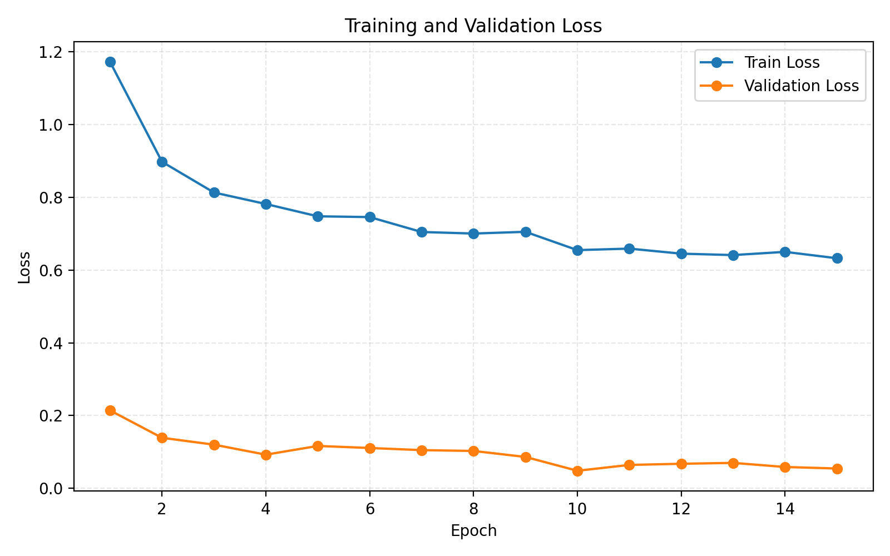
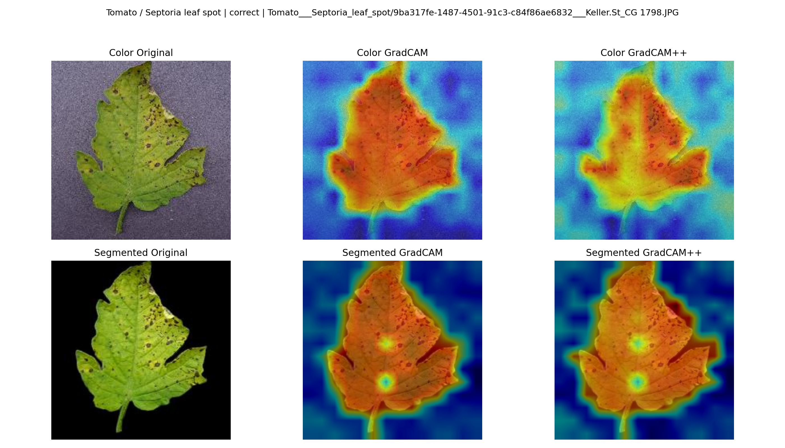
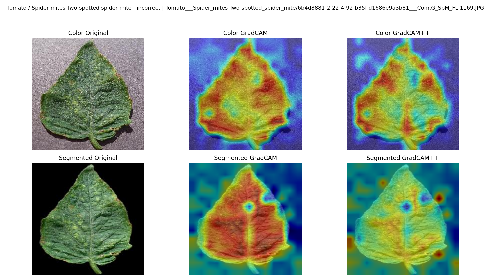

# Plant Disease Recognition via Transfer Learning and GradCAM Explainability on PlantVillage

**COMP6341 Project Report**

**Yang Zhang** — 40332950  
**Yongqi Hao** — 40303141  
**Siming Yi** — 40333494  
**Wenbin Zhang** — 40332403

---

## Abstract

Accurate automated detection of plant diseases is critical for precision agriculture. We present a systematic study on the PlantVillage dataset (54,305 images, 38 classes across 14 plant species) comparing training strategies, model architectures, and input modalities for multi-class leaf disease classification. Starting from a ResNet-18 baseline (97.53% accuracy), we show that full fine-tuning of pretrained models yields the strongest overall results, with **EfficientNet-B3 reaching 99.83% Top-1 accuracy and 99.75% Macro F1** on color images. A ViT-Small pipeline is then used for the modality ablation and GradCAM analysis, where experiments over three dataset versions (color, grayscale, background-segmented) reveal that color is an essential diagnostic feature, while background content has negligible influence on classification. GradCAM and GradCAM++ visualizations confirm that the model focuses on semantically meaningful lesion regions, with identified failure modes concentrated in visually similar disease pairs.

---

## 1. Introduction

Plant pathogens annually destroy an estimated 20–40% of global crop yields, making early and accurate disease diagnosis a pressing challenge. While human experts can identify diseases from leaf imagery, scaling such inspection is infeasible. Convolutional and transformer-based neural networks trained on curated datasets offer a path to scalable, automated diagnosis.

The PlantVillage dataset [Hughes & Salathé, 2015] provides a controlled benchmark with standardized leaf photographs covering healthy and diseased conditions across 14 crop species. Despite high inter-class variety, many disease categories share subtle visual cues (e.g., *Tomato Early Blight* vs. *Tomato Bacterial Spot*), making high-confidence multi-class classification non-trivial.

This work addresses three research questions: (1) How does training strategy (from-scratch vs. linear probing vs. full fine-tuning) affect performance? (2) Does removing background information via segmentation improve accuracy? (3) Which image regions drive model decisions, and where do failures occur?

This project was conducted solely for COMP6341 and is not combined with any other course project.

---

## 2. Dataset and Preprocessing

**PlantVillage** contains 54,305 images organized into 38 disease/health classes. Three input modalities are provided: *color* (RGB), *grayscale*, and *background-segmented* (green background removed). All images are resized to 224×224. The dataset is split deterministically with a fixed seed (80% train / 10% val / 10% test), yielding 43,444 / 5,430 / 5,431 samples for the original color version. The grayscale version reuses the same image identities, while the background-segmented evaluation is reported on the matched subset where segmented counterparts are available.

**Data augmentation** (training only): `RandomHorizontalFlip`, `RandomVerticalFlip`, `RandomResizedCrop(224)`, `ColorJitter(brightness=0.2, contrast=0.2, saturation=0.2, hue=0.05)`, and MixUp (α = 0.4).

---

## 3. Methodology

### 3.1 Models and Training Strategies

We evaluate four model–strategy combinations:

| Model | Strategy | Pretrained | Notes |
|---|---|---|---|
| ResNet-50 [He et al., 2016] | From Scratch | No | No-transfer control |
| EfficientNet-B3 | Linear Probing | Yes (ImageNet) | Frozen backbone, only head trained |
| EfficientNet-B3 | Full Fine-tune | Yes (ImageNet) | All layers updated |
| ViT-Small | Full Fine-tune | Yes (ImageNet) | Patch size 16, full unfreeze |

All models use **AdamW** (weight decay = 1×10⁻⁴) and cross-entropy loss. The baseline uses lr = 1×10⁻³; all other experiments use lr = 3×10⁻⁴. Checkpoints are saved at minimum validation loss; the best checkpoint is used for test evaluation.

### 3.2 GradCAM Explainability

The ViT-Small full fine-tuning model is selected as the analysis target. **GradCAM** [Selvaraju et al., 2017] and **GradCAM++** [Chattopadhay et al., 2018] are applied to the final attention block. We select representative correct examples across the 38 classes and representative incorrect examples from the classes in which test-set errors occur. The three dataset versions are aligned to the color reference split where corresponding images are available, enabling a near-matched cross-modality comparison.

---

## 4. Experiments

### 4.1 ResNet-18 Baseline

A standard ResNet-18 model [He et al., 2016] is trained for 10 epochs (batch size 32) as the project baseline.

**Result:** Test Accuracy = **97.53%**, Test Macro F1 = **96.34%**. The baseline establishes a strong starting point but leaves room for improvement on hard classes.

### 4.2 Model Comparison

Table 1 reports validation-set model selection on the color dataset. The strongest results come from full fine-tuning of pretrained models, while linear probing remains far weaker and the from-scratch ResNet-50 control, although competitive, ranks below the best pretrained runs. MixUp is applied uniformly across settings for consistency, although this may be less compatible with the frozen-backbone linear-probing setup, so the result should be interpreted with some caution.

**Table 1: Model comparison on the color dataset (validation set).**

| Model | Strategy | Val Acc | Val Macro F1 |
|---|---|---|---|
| EfficientNet-B3 | Full Fine-tune | **99.72%** | **99.54%** |
| ViT-Small | Full Fine-tune | 99.30% | 98.89% |
| ResNet-50 | From Scratch | 98.08% | 97.30% |
| EfficientNet-B3 | Linear Probing | 67.31% | 58.01% |

EfficientNet-B3 (full fine-tune) ranks first on validation Macro F1 (99.54%), with ViT-Small second at 98.89% and ResNet-50 from scratch close behind at 97.30%. The main contrast is therefore between full fine-tuning and linear probing: pretrained backbones adapted end-to-end are clearly strongest, while freezing the backbone leaves substantial performance on the table.

Table 2 reports held-out test metrics across all evaluated configurations. EfficientNet-B3 is the top-performing classifier overall, but ViT-Small is retained for the ablation study and explainability analysis to keep the modality comparison and GradCAM workflow on a single explainability-ready pipeline.

**Table 2: Held-out test results for runs with exported test metrics.**

| Model | Strategy | Test Acc | Test Macro F1 |
|---|---|---|---|
| EfficientNet-B3 | Full Fine-tune | **99.83%** | **99.75%** |
| ViT-Small | Full Fine-tune | 99.34% | 99.09% |
| ResNet-50 | From Scratch | 97.72% | 97.18% |
| ResNet-18 | Baseline | 97.53% | 96.34% |
| EfficientNet-B3 | Linear Probing | 67.41% | 58.50% |

|  |  |
|---|---|
| *Figure 1(a): ResNet-18 baseline (10 epochs).* | *Figure 1(b): EfficientNet-B3 full fine-tune (15 epochs).* |

*Figure 1: Training and validation loss curves. EfficientNet-B3 converges faster and reaches a lower validation loss than the ResNet-18 baseline.*

**Key observations:** (1) Linear probing yields only 58% Macro F1 under our current training setup, making it markedly less effective than full fine-tuning on this task. (2) Because MixUp is applied uniformly to all runs, this comparison should be interpreted with some caution for the frozen-backbone linear-probing setting. (3) Full fine-tuning still gives the best overall results, with EfficientNet-B3 outperforming both ViT-Small and the from-scratch ResNet-50 control on the color dataset. (4) The from-scratch ResNet-50 run remains competitive at 97.18% test Macro F1, so the clearest takeaway is not that training from scratch fails outright, but that pretrained end-to-end adaptation is the strongest strategy among the tested configurations.

### 4.3 Input-Modality Ablation

Using ViT-Small (full fine-tune) as the fixed architecture, we compare performance across the three PlantVillage modalities. The color and grayscale rows use the original held-out test split, while the background-segmented row is reported on the matched subset where segmented counterparts are available.

**Table 3: Ablation study — ViT-Small across dataset versions.**

| Dataset Version | Test Accuracy | Test Macro F1 | ΔAcc vs. Color |
|---|---|---|---|
| Color | **99.34%** | **99.09%** | — |
| Background Segmented | 99.25% | 99.09% | −0.09% |
| Grayscale | 95.86% | 94.46% | −3.48% |

Removing color information (grayscale) causes a **−3.48% accuracy drop**, the largest degradation observed. This confirms that chromatic texture is a primary diagnostic cue for diseases such as rust, mold, and yellowing. Background segmentation produces only a **−0.09% drop** on the matched subset used for comparison, suggesting the model is inherently robust to background clutter, but this number should be interpreted as a near-matched comparison rather than a perfectly identical test-set evaluation.

### 4.4 Explainability and Failure Analysis

**Hardest classes.** Table 4 lists the hardest class (lowest per-class recall) for each input modality. The *Potato / Healthy* class is consistently the most difficult, likely due to low test-set support (14 samples) and visual similarity to *Soybean / Healthy*. The most frequent confusion pairs are: *Peach / Bacterial Spot* → *Tomato / Septoria Leaf Spot* (5 errors, color); *Tomato / Spider Mites* → *Tomato / Healthy* (21 errors, grayscale); and *Tomato / Early Blight* → *Tomato / Bacterial Spot* (7 errors, background-segmented).

**Correct prediction.** Figure 2 shows a representative correct classification of *Tomato / Septoria Leaf Spot*. GradCAM and GradCAM++ highlight lesion-bearing regions and broadly align with the visible disease pattern, supporting the plausibility of the learned decision process.

*Figure 2: GradCAM and GradCAM++ visualization for a representative correct prediction, Tomato / Septoria Leaf Spot. The model attends to lesion-bearing regions, indicating that the prediction is driven by disease-relevant evidence.*

**Failure mode.** Figure 3 shows a representative incorrect prediction of *Tomato / Spider mites two-spotted spider mite*. In this case, the attention becomes more diffuse and less discriminative, spreading across broader leaf regions rather than isolating the most informative symptoms.

*Figure 3: GradCAM and GradCAM++ visualization for a representative incorrect prediction, Tomato / Spider mites two-spotted spider mite. The attention is broader and less discriminative than in the correct case, consistent with model uncertainty and confusion among visually similar diseases.*

**Table 4: Hardest classes per dataset version (lowest per-class recall).**

| Dataset | Class | Support | Recall |
|---|---|---|---|
| Color | Potato / Healthy | 14 | 78.6% |
| Background Segmented | Tomato / Early Blight | 114 | 91.2% |
| Grayscale | Potato / Healthy | 14 | 57.1% |

---

## 5. Conclusion

We systematically studied plant disease classification on PlantVillage under multiple training strategies, architectures, and input modalities. Full fine-tuning of pretrained models provides the best overall performance, with **EfficientNet-B3 achieving 99.83% Top-1 accuracy and 99.75% Macro F1** on the color test set. The ViT-Small pipeline remains strong and is used for the modality ablation and GradCAM analysis. The weak linear-probing result should be interpreted as a result under the current training configuration, since MixUp may be less compatible with the frozen-backbone setting. These experiments establish that **color is a critical diagnostic modality** (−3.5% accuracy when removed), while background removal yields minimal benefit. GradCAM analysis validates that the model attends to lesion-bearing regions on correct predictions; failure modes are concentrated in low-support classes and visually ambiguous disease pairs.

A limitation of this study is that the dataset uses a random image-level split on a highly curated benchmark, which may allow closely related images from the same class distribution to appear across training and test sets and thus make evaluation somewhat optimistic. In addition, PlantVillage images are captured under unusually clean laboratory-style conditions, so the results may not fully transfer to real field environments with cluttered backgrounds, occlusion, and variable lighting. Future work should therefore explore class-balanced sampling, stronger evaluation on less curated real-world datasets, and training setups designed for better robustness under realistic agricultural conditions.

---

## References

- Hughes, D., & Salathé, M. (2015). *An open access repository of images on plant health to enable the development of mobile disease diagnostics.* arXiv:1511.08060.
- Selvaraju, R. R., et al. (2017). *Grad-CAM: Visual explanations from deep networks via gradient-based localization.* ICCV.
- Chattopadhay, A., et al. (2018). *Grad-CAM++: Generalized gradient-based visual explanations for deep convolutional networks.* WACV.
- Dosovitskiy, A., et al. (2021). *An image is worth 16×16 words: Transformers for image recognition at scale.* ICLR.
- Tan, M., & Le, Q. V. (2019). *EfficientNet: Rethinking model scaling for convolutional neural networks.* ICML.
- He, K., Zhang, X., Ren, S., & Sun, J. (2016). *Deep residual learning for image recognition.* CVPR.
